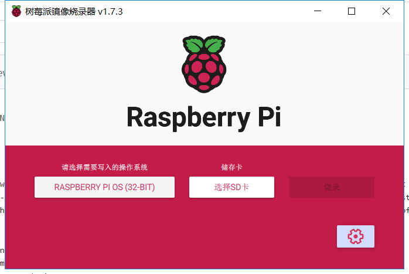
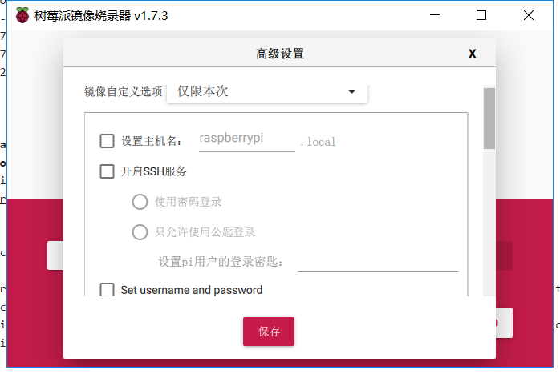
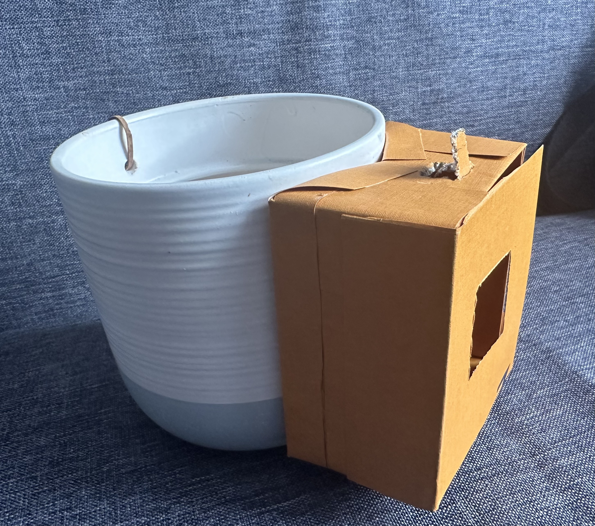
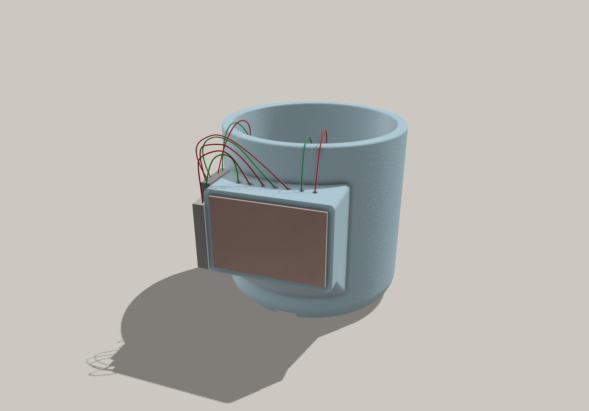
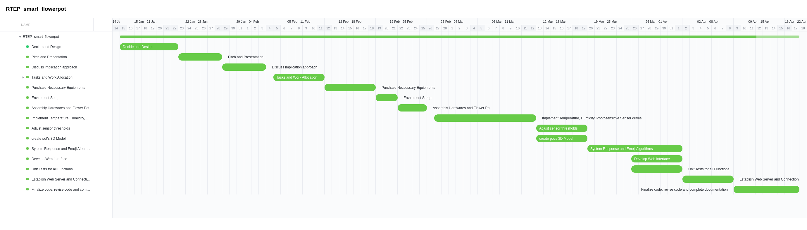

# Smart Flowerpot
The project about ENG5220: Real Time Embedded Programming (2022-23)

Group 27

## Description
The intelligent flowerpot is designed to help you to ensure the plants optimal growth. With sensors, it can monitor your plants’ temperature, humidity and light level. It features a built-in screen that expresses the mood of your plants through emoji and real-time statistics to remind you what you should do to take good care of your lovely plant. Meanwhile, we have built a website interface to monitor and observe real-time condition of your plant remotely.
 
## Features
1) Visual expression of plants' mood
2) Real-time and remote monitor on web server
3) Connect to your smart device
4) Immediate feedback of environment figures
5) Intuitive screen display of plants' emojis

## Contributors
|  Name   | ID  | Role |
|  ----  | ----  | ----  |
| Xingtao Zeng  | 2721279z | C++ Software Engineer | 
| Wenbo Yang  | 2727018y | Hardware and 3D Model Engineer | 
| Qidi Wang  | 2724200w | Web Application Engineer| 

# Video Demo Link
The video will introduce key features and real-time responses to enviroment changes
https://drive.google.com/drive/folders/11dj5n3dzrHT3IjsJquE8c0qLd-phn4Rf?usp=sharing

# Guide

## 1. Software Installation and Enviroment Setup
### 1.1 Raspberry Configuration
Install Raspberry Pi Imager
https://www.raspberrypi.com/software/

Select according to operating system.



After finishing the installment, choose os and storage.
Our project deside raspberry pi os(31-BIT). Then remember we have to click on the advanced settings in the bottom right hand corner. We need to turn on the SSH function of the Raspberry Pi and we deliberately remote the session too. if you miss the part ,its fine.



Click burn, then wait a lot of time for the burn to succeed and install the SD card into the card slot of the Raspberry Pi board, plug in the power, the Raspberry Pi initialization configuration is successful


#### Enable SPI 
```
sudo raspi-config
Choose Interfacing Options -> SPI -> Yes  to enable SPI interface
```


#### Enble SSH
```
sudo raspi-config
Choose Interfacing Options -> SSH -> Yes  to enable SSH interface
```
Actually this step is up to you, our group don't have a HDMI screen. So we choose that way. 

#### Install Libraries
```
sudo apt-get install wiringpi

#For the Raspberry Pi system after May 2019, it may need to be upgraded

wget https://project-downloads.drogon.net/wiringpi-latest.deb
sudo dpkg -i wiringpi-latest.deb
gpio -v
#You will get 2.52 information if you install it correctly

#Bullseye branch system use the following command:
git clone https://github.com/WiringPi/WiringPi
cd WiringPi
./build
gpio -v

# Run gpio -v and version 2.60 will appear. If it does not appear, it means that there is an installation error
```


## 2. HardWare Build
### 2.1 Raspberry Pi B+/4B+
When connecting the Raspberry Pi, choose to use the 7PIN cable to connect, please refer to the pin correspondence table below.
|OLED	|Raspberry Pi|
|  ----  | ----  |
|VCC	|	3.3V|
|GND	|GND|
|DIN	|	19 / 3|
|CLK		|23 / 5|
|CS		|24|
|DC	|	22|
|RST	|	13|


### 2.2 DHT11 Module (Humidity & Temperautre)
Wire Connection for DHT11 Module
|DHT	|Raspberry Pi|
|  ----  | ----  |
|VCC/+	|	3.3V-5V|
|OUT/DATA/D| 7|
|-/GND	|GND|

### 2.3 Photosensitive Diode Sensor
Wire Connection Photosensitive module
|PDC	|Raspberry Pi|
|  ----  | ----  |
|VCC	|	3.3V-5V|
|DO| 11|
|AO| NOT USED|
|GND	|GND|

### 2.4 128*128 RGB OLED with SPI Interface, or anyother compatiable LED devices to Raspberry Pi B+/4B+


### 2.5 Plant pot that can accommodate the above-mentioned devices
Here are two options: 
1. DIY your handmade flower pot, make sure to wrap your wires and devices with waterproof materials to avoid water damage to the circuit.



2. 3D print your flower pot, the modeling code (plant pot.obj) and images can be found in "Pot_3D_Model" folder at the github repository.



## 3. Web Application Setup

The purpose of creating a web page is that people and people under the same LAN can access the IP address of the Raspberry Pi via a browser to be able to check the status of the beloved little flower.

### Install libraries
```
sudo apt-get install python3
sudo apt-get install python3-pip
sudo pip3 install --upgrade pip

#  Note: If your Raspberry Pi already has Python 3 installed, you can upgrade to the latest version using the following command
sudo apt-get upgrade python3
```
Our whole project was developed in C++, but it was quite difficult to develop a server as C++. Our initial aim was just to build a smart planter, building a website was not our original intention. So we chose BOTTLE, a q-lightweight application to build the webpage.

```
sudo pip install bottle

```
When the download is complete, we also need to download a dependency package Adafruit_DHT. 

We use the Raspberry Pi in conjunction with the dht11, a temperature and humidity sensor, to easily obtain ambient temperature and humidity readings. 
The dependency package is also the PYTHON version of the DHT11 library, which works very well and is very easy to build web pages with bottle.
```
git clone https://github.com/adafruit/Adafruit_Python_DHT.git
cd Adafruit_Python_DHT
sudo python setup.py install

#  Once installed, you can test that the Adafruit_DHT library is working properly by using the following command.
#  This will display the sensor reading in the terminal (assuming you are using a DHT11 sensor and it is connected to the GPIO4 pin).
cd examples
sudo ./AdafruitDHT.py 11 4
```
In fact, the final web page is built by giving the html code file as a string to the variable html, which is then parsed by Bottle. 
The web-specific variables are then read by Adafruit_DHT, which is a babysitting exercise!

# Unit Test
### Install Google Test (gtest)
```
git clone https://github.com/google/googletest.git
cd googletest
mkdir build
cd build
cmake ..
make
sudo make install
```
cmake is also not the default installation library for the Raspberry Pi and you may need to install it as well.

```
sudo apt-get install cmake
```

### Run Unit Tests
Every unit test compilation requires a library dependency.
-lgtest -lgtest_main -pthread
```
$ g++ RTEP_smart_flowerpot/unit_test/dht_test.cpp -o dht_test -lgtest -lgtest_main -pthread
$ ./dht_test

$ g++ RTEP_smart_flowerpot/unit_test/getTime_test.cpp -o getTime_test -lgtest -lgtest_main -pthread
$ ./getTime_test

$ g++ RTEP_smart_flowerpot/unit_test/sensor_test.cpp -o sensor_test -lgtest -lgtest_main -pthread
$ ./sensor_test

$ g++ RTEP_smart_flowerpot/unit_test/timer_test.cpp -o timer_test -lgtest -lgtest_main -pthread
$ ./timer_test
```

# Project Management
## Work Distribution
During the initial meeting, each member of the team presented their unique skillset and prior experience. Drawing upon the available resources, we collectively identified suitable roles and responsibilities for each team member.
|  Name   |  Role | Tasks | 
|  ----  | ----  | ----  | 
| Xingtao Zeng  |  C++ Software Engineer | Purchase Neccessary Equipments,Implement Temperature, Humidity, Photosensitive Sensor drives, System Response and Emoji Algorithms|
| Wenbo Yang  | Hardware and 3D Model Engineer | Assembly Hardwares and Flower Pot, Adjust sensor thresholds, create pot's 3D Model|
| Qidi Wang  | Web Application Engineer| Develop Web Interface, Unit Tests for all Functions, Establish Web Server and Connection|

## Progress Tracker
Our team held regular weekly meetings to facilitate discussions on task management, progress tracking, issue and bug presentation, and recognition of weekly accomplishments. In situations where additional meetings were deemed necessary, they were scheduled accordingly. Furthermore, we diligently recorded meeting minutes to accurately monitor and document team activities.

We documented our weekly plan and progress in the Gantt Chart



# Future Plan & Marketing Value
Our future plan for the intelligent flowerpot involves developing and implementing more advanced sensors and technologies to enhance its ability to monitor and regulate plant growth. We also plan to expand our product line to include various sizes and designs to cater to different customer needs. In addition, we aim to collaborate with botanical experts to incorporate their insights and recommendations for optimal plant growth. In terms of the marking value of our product, we will conduct market research and analysis to determine a competitive and fair price at around £50. We will emphasize the unique features and benefits of the intelligent flowerpot, such as real-time monitoring, mood expression, and remote access through a website interface. To increase brand awareness and engagement, we will utilize social media and influencer marketing. Furthermore, we will offer customer support and resources, such as tutorials and FAQs, to ensure a positive user experience and increase customer satisfaction.

# Social media
Instagram: https://www.instagram.com/rtepsmartflowerpot9/

Facebook: https://www.facebook.com/profile.php?id=100092231731079


